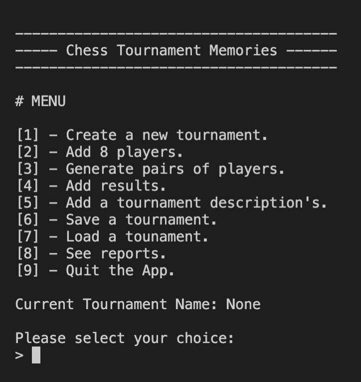

# Chess Tournament Memories (Python using the MVC pattern).

## CONTENTS

1. [Project initialization](#id-section1)
    1. [Windows](#id-section1-1)
    1. [MacOS / Linux](#id-section1-2)
    3. [Generate flake8 report](#id-section1-3)
2. [Menu Options](#id-section2)
    1. [Main Menu](#section2-1)
    2. [Reports Menu](#section2-2)

## 1. Project initialization

#### i. Windows :
In Windows Powershell, go to the folder where you want to copy the application.

###### Clone the project
    $ git clone https://github.com/songta17/op4-v2.git

###### Enable virtual environment
    $ cd op4-v2
    $ python -m venv env 
    $ ~env\scripts\activate
    
###### Install required packages
    $ pip install -r requirements.txt

###### Start the program
    $ python chess_tournament_memories.py

---------

#### ii. MacOS / Linux :
In the terminal, go to the folder where you want to copy the application.
###### Clone the project
    $ git clone https://github.com/songta17/op4-v2.git

###### Enable virtual environment
    $ cd op4-v2
    $ python3 -m venv env 
    $ source env/bin/activate
    
###### Install required packages
    $ pip install -r requirements.txt

###### Start the program
    $ python3 chess_tournament_memories.py

----------

#### iii. Generate flake8 report

    $ flake8 --format=html --htmldir=flake-report
open flake-report/index.html

**You will find the report in the file _'flake8-report'_.**

## 2. Menu Options

#### i. Main Menu 

#### ii. Reports Menu

